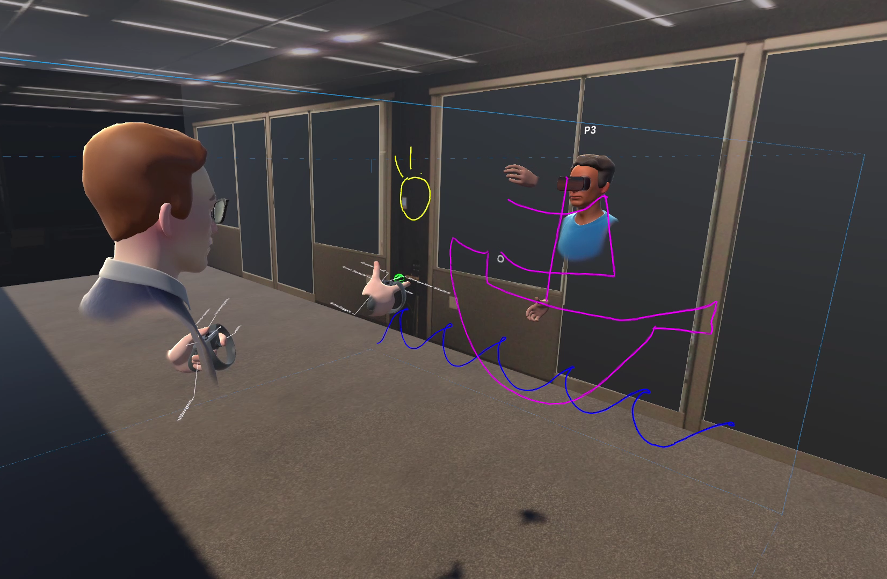

# VR MultiuserWorkstation

https://github.com/KTRosenberg/Exploring-Configuration-of-Mixed-Reality-Spaces-for-Communication/assets/16908296/3f91857b-5a9b-40ba-a597-a623d2054dcd

This VR system enables collaborative drawing at dynamic whiteboards with the ability to reconfigure orientation of content and the perspectives between each user. The idea is that reconfiguring the creative/work-space as well as your position-orientation with respect to your collaborators should give you a lot more flexibility than the limitations of real-life would allow, allowing us to be more productive depending on our own needs. The options are:

1. drawing on a vertical whiteboard side-by-side (traditional) 
2. drawing opposite each other face-to-face through a transparent board, with each user viewing the content flipped to retain gaze information when looking at the same content (inspired by Clearboard https://tangible.media.mit.edu/project/clearboard/)
3. the user draws on a private flat virtual surface (like a drawing tablet) with the content projected on the vertical board for everyone to see together.

Additionally, I played with the workflow idea of drawing on the planes first, then pulling the content out into the 3D space:

https://github.com/KTRosenberg/Exploring-Configuration-of-Mixed-Reality-Spaces-for-Communication/assets/16908296/97028613-9478-4f0b-a85b-5f8ee1e473ad

## Paper
See https://dl.acm.org/doi/abs/10.1145/3290607.3312761 for the paper and video demos.

### Abstract
Mixed Reality (MR) enables users to explore scenarios not realizable in the physical world. This allows users to communicate with the help of digital content. We investigate how different configurations of participants and content affect communication in a shared immersive environment. **We designed and implemented side-by-side, mirrored face-to-face and eyes-free configurations in our multi-user MR environment** and conducted a preliminary user study for our mirrored face-to-face configuration, evaluating with respect to one-to-one interaction, smooth focus shifts and eye contact within a 3D presentation using the interactive Chalktalk system. We provide experimental results and interview responses.

Note: the sketches and sketch recognition come from the existing project "Chalktalk," whose functionality interoperates with this project via client/server communication.
